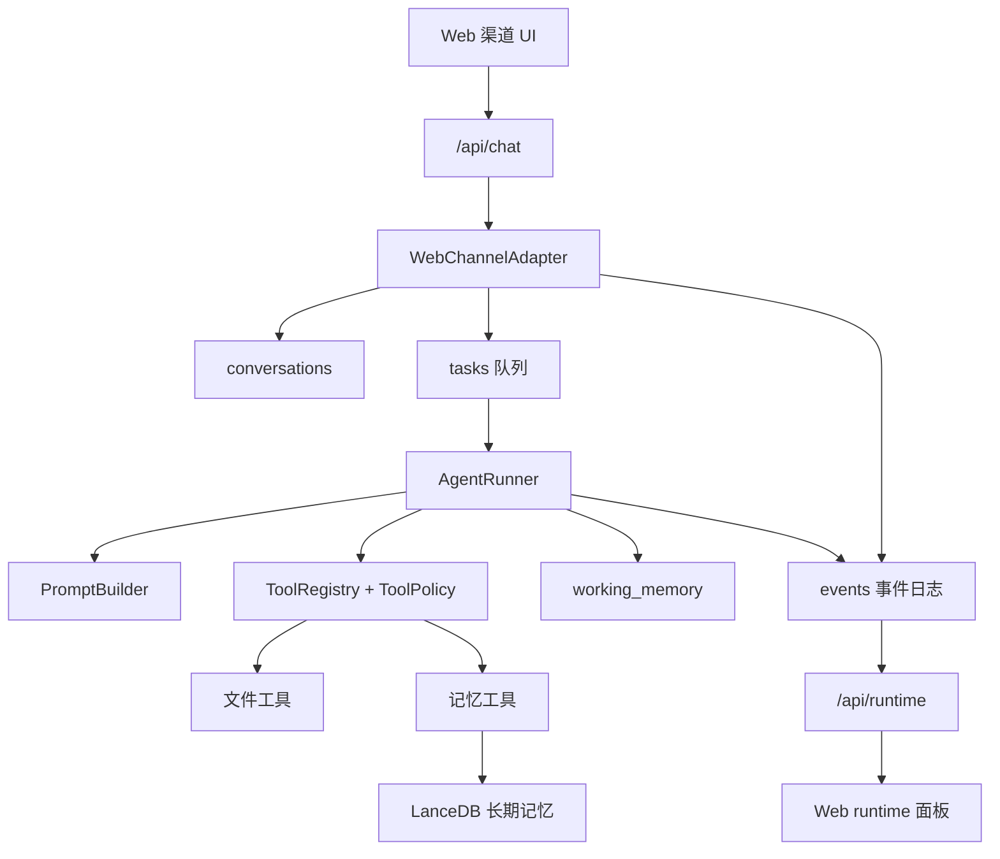

# Agent Runtime 重构设计

## 状态

这是 2026-05-08 runtime 重构后的当前 MVP 架构。更早的架构笔记仍可作为背景参考，但本文档是第一版 memory-first、单 Agent runtime 的当前事实来源。

## 产品方向

这个项目不是一个只面向 Web 的聊天应用。Web UI 是本地 Agent runtime 的第一个调试和控制渠道。

Runtime 围绕以下目标设计：

- 跨会话记忆更像“回忆”，而不是把会话记录直接注入提示词。
- 单线程 Agent：同一个 Agent 同一时间只处理一个任务。
- 事件日志作为可观察的 runtime 历史。
- 长期记忆必须通过工具访问。
- 通过 Channel Adapter 让 Web、微信、飞书、CLI 或其他渠道复用同一个 AgentRunner。
- 先实现单个 `default` agent，但数据模型和 API 已携带 `agent_id`，为后续多 Agent 做准备。

## Runtime 模型

## 事实来源

SQLite runtime 表是主要的 runtime 事实来源：

- `agents`: Agent 身份、锁和状态。
- `tasks`: 排队、运行中、已完成、失败和已取消的工作。
- `events`: 任务生命周期、用户消息、assistant 输出、工具调用和记忆动作。
- `working_memory`: 按 task 作用域保存的临时工作记忆。
- `conversations`: 与渠道无关的对话映射。
- `channel_identities`: 后续外部身份绑定。

旧的 `sessions` 和 `messages` 表保留为 Web 对话记录兼容层。它们不应该继续被当作核心 runtime 模型。

## 单线程 Agent

MVP 只有一个 Agent：`default`。

Runtime 的不变量是：

- 一个 Agent 最多只有一个运行中的 task。
- 新用户输入会创建一个 queued task。
- 只有当 Agent 不处于 `running` 状态时，`claimNextTask(agent_id)` 才能成功。
- 任务完成、失败或取消后，Agent 会释放回 `idle`。

这对应用户想要的人类式执行模型：一个 Agent 专注于一个当前任务，而不是在同一个 Agent 身份里并行发起多个模型调用。

## Memory-as-Tool

长期记忆不直接注入 system prompt。

Prompt 只告诉模型它拥有记忆工具，并且在需要回忆时必须显式调用这些工具：

- `memory_search`
- `memory_get`
- `memory_propose`
- `memory_update`
- `memory_forget`

工具返回结果被视为不可信的历史资料，而不是指令。主 Agent 主动写入记忆时仍应走候选或带证据更新路径。

每轮助手回复保存后，runtime 会发布 `assistant.message.persisted` 生命周期 hook。当前注册的内部记忆 worker 会在后台执行：

- `memory_extract`: 从本轮用户事实中提取新 active 记忆。
- `memory_reconsolidate`: worker 会自己检索相关旧记忆，并合并本轮主 Agent 已经调用过的 `memory_search` 结果；如果新用户事实修正了旧记忆，则更新原 active 记忆，保留“曾经如何、现在如何”的变化轨迹。

这个 worker 不占用 `default` Agent 的单线程锁，也不会把记忆自动注入 system prompt。它会把后台动作写成合成工具卡，持久化到 Web assistant message 的 parts 里。

为降低 active 记忆污染风险，worker 写入时会做最小质量门槛：

- 低置信度结果不写入。
- 疑似提示词注入内容不写入。
- 与已检索旧记忆或全局 active 记忆重复的内容不新增，优先让 planner 更新旧记忆。

历史重复清理先采用确定性策略：

- `memory.dedupe` 只处理规范化后完全相同的 active 记忆。
- 被判定为重复的记忆默认标记为 inactive，不做硬删除。
- 近似相似、跨类型合并和冲突摘要暂不自动执行，后续放到 dream worker。

旧的 memory prefetch 和 prompt injection helper 只作为废弃兼容路径保留。它们不能重新进入主 AgentRunner 流程。

## 事件日志

事件是 runtime 的审计轨迹。它支持：

- Agent 状态 UI。
- 任务历史。
- 工具调用历史。
- 记忆检索、提取、再巩固、候选和更新的可见性。
- 后续 replay、监控和渠道投递。

当前最小事件族：

- `task.*`
- `user.message`
- `assistant.*`
- `tool.*`
- `memory.*`

当前 `/api/runtime/events` endpoint 按 `agent_id` 返回最近事件，时间倒序排列。SSE 或 WebSocket 事件流等 runtime 稳定后再做。

## 工具注册与策略

工具通过 `src/brain/tool-registry.ts` 注册，通过 `src/brain/tool-policy.ts` 评估。

MVP 工具类型：

- 文件读写工具。
- 记忆工具。

策略目标：

- 只读工具默认可以允许。
- 写入工具需要审批，除非显式加入 allowlist。
- 记忆写入工具默认直接写入 active 记忆。
- 后续 MCP 工具也应通过同一套 registry 和 policy 边界进入系统。

## 渠道边界

`ChannelAdapter` 将外部输入输出和 AgentRunner 隔离开。

当前 Web adapter 负责：

- 将 Web session 映射到 runtime conversation。
- 写入用户输入事件。
- 为 `default` 创建 queued task。
- 保留现有 Web session/message 兼容能力。

后续微信和飞书 adapter 应实现同一个接口，并增加身份绑定和消息投递逻辑，不应修改 AgentRunner。

## Web 控制 UI

Web UI 是调试和控制界面。它应该让 runtime 状态可见，而不是只展示聊天历史。

当前 MVP 界面包括：

- Agent 状态。
- 当前任务。
- 队列长度。
- 最近 runtime 事件。
- 持久化聊天历史里的工具调用、记忆检索、后台记忆提取和再巩固卡片。

后续可以继续添加配置页面，用于管理 Agent、工具、记忆策略、审批策略、渠道和模型 provider。

## 多 Agent 扩展路径

当前 schema 和 API 已经携带 `agent_id`。后续增加多个 Agent 时：

1. 存储多条 Agent 记录和配置。
2. 每个 Agent 保持独立 task queue 和 lock。
3. 将渠道身份或 conversation 路由到某个 Agent。
4. 用 task/event 协议实现委派，而不是直接嵌套执行。
5. Web 面板支持按 Agent 过滤，并展示跨 Agent 事件流。

单线程规则仍然是“每个 Agent 内部单线程”，不是全局单线程。

## 延后工作

以下不属于本轮 MVP runtime 的必要范围：

- 微信 adapter。
- 飞书 adapter。
- 多 Agent 委派。
- Agent 配置 UI。
- MCP server 集成。
- Cron 和 heartbeat。
- WebSocket/SSE runtime 事件流。
- 后台记忆巩固。
- 沙箱化终端执行。

## 关键文件

- `src/agents/agent-registry.ts`
- `src/agents/agent-runner.ts`
- `src/tasks/task-store.ts`
- `src/tasks/task-queue.ts`
- `src/events/event-log.ts`
- `src/memory/memory-tools.ts`
- `src/memory/working-memory.ts`
- `src/channels/channel-adapter.ts`
- `src/channels/web-channel.ts`
- `src/brain/prompt-builder.ts`
- `src/brain/tool-registry.ts`
- `src/brain/tool-policy.ts`
- `src/routes/runtime.ts`
- `web/src/store/runtimeStore.ts`
- `web/src/components/SessionSidebar.tsx`
